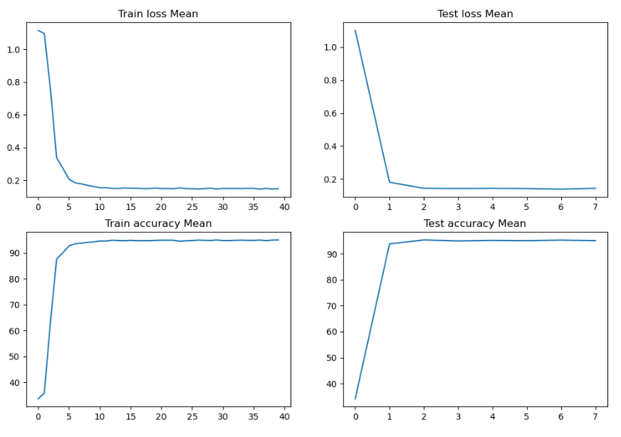
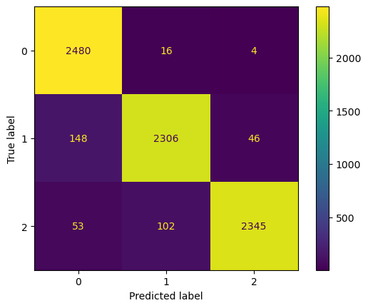
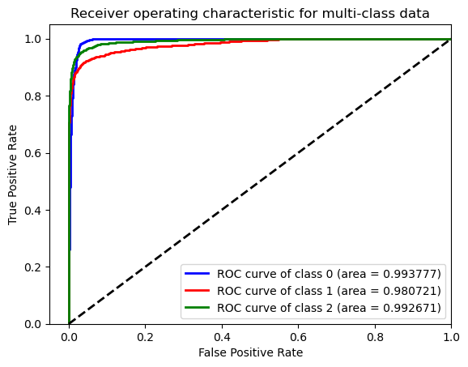

# Common Test I. Multi-Class Classification

**Task:** Build a model for classifying the images into lenses using PyTorch or Keras. Pick the most appropriate approach and discuss your strategy.

**Dataset Description:** The Dataset consists of three classes, strong lensing images with no substructure, subhalo substructure, and vortex substructure. The images have been normalized using min-max normalization, but you are free to use any normalization or data augmentation methods to improve your results.

**Evaluation Metrics:** ROC curve (Receiver Operating Characteristic curve) and AUC score (Area Under the ROC Curve) 

# Solution
## Data Preparation
The data preparation steps include data loading and applying data augmentation techniques to improve model performance. For this task, the following data augmentation techniques were applied:

```python
transforms.RandomCrop(128),
transforms.Resize(256),
transforms.RandomRotation(180),
transforms.ColorJitter(brightness=(0.8, 1.2)),
transforms.Resize(128),
transforms.Grayscale(num_output_channels=1)
```

These transforms randomly crop the images, resize them to 256x256, perform random rotations up to 180 degrees, adjust the brightness, resize the images to 128x128, and convert them to grayscale.

# Model Selection

I initially tried several popular models like VGG, ResNet, and ViT, but none of them performed well on this task. Therefore, I decided to use Steerable CNNs, which are E(2)-Equivariant CNNs. The feature maps of a GCNN are functions over the elements of the group. A naive implementation of group-convolution requires computing and storing a response for each group element. For this reason, the GCNN framework is not particularly convenient to implement networks equivariant to groups with infinite elements.

Steerable CNNs are a more general framework that solves this issue. The key idea is that, instead of storing the value of a feature map on each group element, the model stores the Fourier transform of this feature map, up to a finite number of frequencies. This makes it possible to build a model that is equivariant with respect to any transform, even for more esoteric cases like points on a sphere or mirror operations.

I followed the following two resources for information and implementation:
- [E(2)-Equivariant Neural Networks are Part of Geometric Deep Learning](https://dmol.pub/dl/Equivariant.html#:~:text=Equivariant%20neural%20networks%20are%20part,graphs%2C%20geodesics%2C%20and%20gauges.)
- [Tutorial on Steerable CNNs in PyTorch](https://uvadlc-notebooks.readthedocs.io/en/latest/tutorial_notebooks/DL2/Geometric_deep_learning/tutorial2_steerable_cnns.html)

# Training and Evaluation
I trained the Steerable CNN model for 40 epochs using the Adam optimizer with a learning rate of 0.001, weight decay of 1e-5, and a batch size of 64. The model was trained on a Kaggle GPU P100 with 16GB VRAM for faster computation.

The loss function used during training was cross-entropy loss. To adjust the learning rate during training, I used a StepLR scheduler with a step size of 5 and a gamma value of 0.1.

To evaluate the performance of the Steerable CNN model, I used ROC curve and AUC score (mentioned in the task), as well as confusion matrix. 

# Results

These are the Results:

## Loss plot



## Confusion Matrix



## ROC Curve



## AUC Score
AUC-SCORE 0.9928092533333333

# Citations
```bibtex
@inproceedings{e2cnn,
    title={{General E(2)-Equivariant Steerable CNNs}},
    author={Weiler, Maurice and Cesa, Gabriele},
    booktitle={Conference on Neural Information Processing Systems (NeurIPS)},
    year={2019},
}

@inproceedings{jenner2022steerable,
    title={Steerable Partial Differential Operators for Equivariant Neural Networks},
    author={Erik Jenner and Maurice Weiler},
    booktitle={International Conference on Learning Representations},
    year={2022},
    url={https://openreview.net/forum?id=N9W24a4zU}
}
```