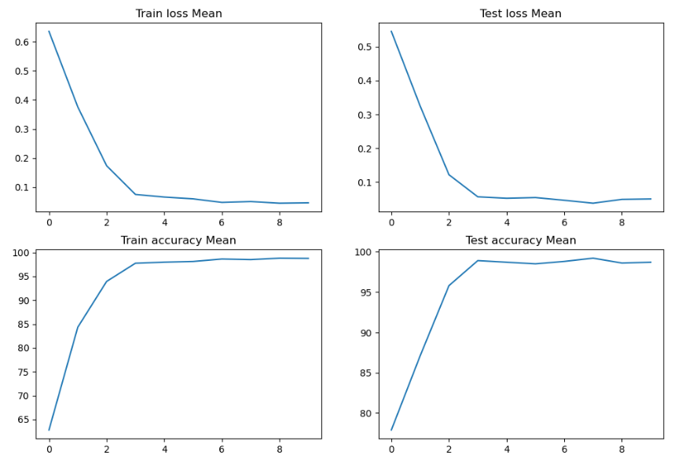
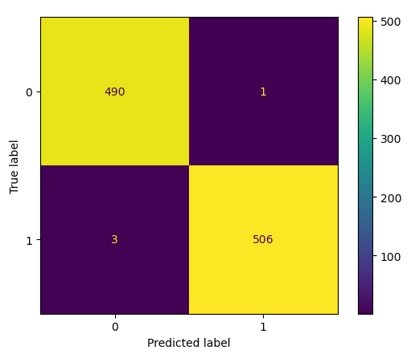

# Specific Test IV. Exploring Equivariant Neural Networks

**Task:** Use an Equivariant Neural Network of your choice to build a robust and efficient model for binary classification or unsupervised anomaly detection on the provided dataset. In the case of unsupervised anomaly detection, train your model to learn the distribution of the provided strong lensing images with no substructure. Please implement your approach in PyTorch or Keras and discuss your strategy.			

**Dataset Description:** A set of simulated strong gravitational lensing images with and without substructure. 

**Evaluation Metrics:** ROC curve (Receiver Operating Characteristic curve) and AUC score (Area Under the ROC Curve)

# Solution
## Data Preparation
The data preparation steps include data loading and applying data augmentation techniques to improve model performance. For this task, the following data augmentation techniques were applied:

```python
transforms.RandomCrop(128),
transforms.Resize(256),
transforms.RandomRotation(180),
transforms.ColorJitter(brightness=(0.8, 1.2)),
transforms.Resize(128),
transforms.Grayscale(num_output_channels=1)
```

These transforms randomly crop the images, resize them to 256x256, perform random rotations up to 180 degrees, adjust the brightness, resize the images to 128x128, and convert them to grayscale.

## Model Selection
I have used 
- Steerable CNNs, which are E(2)-Equivariant CNNs
- Equivariant Wide ResNet

## Training and Evaluation
For **Steerable CNN**:
I trained the model for 10 epochs using the Adam optimizer with a learning rate of 0.0001, and a batch size of 64. The model was trained on a Kaggle GPU P100 with 16GB VRAM for faster computation. The loss function used during training was cross-entropy loss. To adjust the learning rate during training, I used a StepLR scheduler with a step size of 5 and a gamma value of 0.7.

For **Equivariant Wide ResNet**:
I trained the model for 10 epochs using the Adam optimizer with a learning rate of 0.001, and a batch size of 16. The model was trained on a Kaggle GPU P100 with 16GB VRAM for faster computation. The loss function used during training was cross-entropy loss. To adjust the learning rate during training, I used a StepLR scheduler with a step size of 3 and a gamma value of 0.1.

To evaluate the performance of the models, I used ROC curve and AUC score (mentioned in the task), as well as confusion matrix.

## Results

### These are the Results for **Steerable CNN**:

#### Loss plot


#### Confusion Matrix


#### ROC Curve


#### AUC Score
AUC-SCORE: 0.9857433808553971

### These are the Results for **Equivariant Wide ResNet**:

#### Loss plot


#### Confusion Matrix


#### ROC Curve


#### AUC Score
AUC-SCORE: 0.9960347152477401

------------------------------------
| model | AUC-SCORE | Best Accuracy |
| --- | --- | --- |
| Steerable CNN | 0.9857433808553971 | 99.00% |
| Equivariant Wide ResNet | 0.9960347152477401 | 99.20% |

# Citations

```bibtex
@inproceedings{e2cnn,
    title={{General E(2)-Equivariant Steerable CNNs}},
    author={Weiler, Maurice and Cesa, Gabriele},
    booktitle={Conference on Neural Information Processing Systems (NeurIPS)},
    year={2019},
}

@inproceedings{jenner2022steerable,
    title={Steerable Partial Differential Operators for Equivariant Neural Networks},
    author={Erik Jenner and Maurice Weiler},
    booktitle={International Conference on Learning Representations},
    year={2022},
    url={https://openreview.net/forum?id=N9W24a4zU}
}
```

# Warning!
If loading the model from checkpoint please ensure that `strict=False`.
```python
model.load_state_dict(torch.load('bestmodel.pth'), strict=False)
```