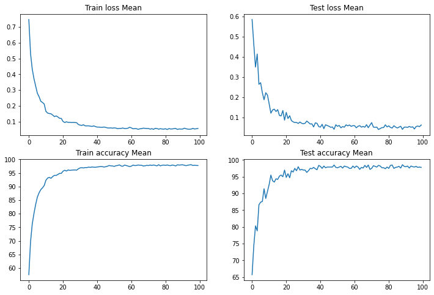
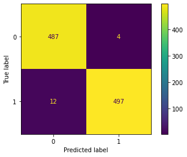
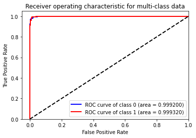

# Specific Test V. Exploring Transformers

**Task:** Use a vision transformer method of your choice to build a robust and efficient model for binary classification or unsupervised anomaly detection on the provided dataset. In the case of unsupervised anomaly detection, train your model to learn the distribution of the provided strong lensing images with no substructure. Please implement your approach in PyTorch or Keras and discuss your strategy.

**Dataset Description:** A set of simulated strong gravitational lensing images with and without substructure.

**Evaluation Metrics:** ROC curve (Receiver Operating Characteristic curve) and AUC score (Area Under the ROC Curve)

# Solution
## Data Preparation
The data preparation steps include data loading and applying data augmentation techniques to improve model performance. For this task, the following data augmentation techniques were applied:

```python
transforms.RandomCrop(128),
transforms.Resize(256),
transforms.RandomRotation(180),
transforms.ColorJitter(brightness=(0.8, 1.2)),
transforms.Resize(128),
transforms.Grayscale(num_output_channels=1)
```

These transforms randomly crop the images, resize them to 256x256, perform random rotations up to 180 degrees, adjust the brightness, resize the images to 128x128, and convert them to grayscale.

## Model Selection
Initially, I tried using the Vision Transformer (ViT) for this task, but it didn't perform as well as I had hoped. Therefore, I decided to use the Convolutional vision Transformer (CvT) model. CvT improves on ViT's performance and efficiency by introducing convolutions to ViT to yield the best of both designs. It accomplishes this through two primary modifications: a hierarchy of Transformers containing a new convolutional token embedding, and a convolutional Transformer block leveraging a convolutional projection. These changes introduce desirable properties of convolutional neural networks (CNNs) to the ViT architecture, such as shift, scale, and distortion invariance, while maintaining the merits of Transformers, including dynamic attention, global context, and better generalization.

For this project, I used the CvT implementation by Phil Wang, available at https://github.com/lucidrains/vit-pytorch/blob/main/vit_pytorch/cvt.py, with slight modifications to use it with the given dataset.

## Training and Evaluation
I trained the model for 100 epochs using the Adam optimizer with a learning rate of 0.0001, and a batch size of 64. The model was trained on a Kaggle GPU P100 with 16GB VRAM for faster computation. The loss function used during training was cross-entropy loss. To adjust the learning rate during training, I used a StepLR scheduler with a step size of 10 and a gamma value of 0.5.

To evaluate the performance of the model, I used ROC curve and AUC score (mentioned in the task), as well as confusion matrix.

## Results
### Loss plot


### Confusion Matrix


### ROC Curve


### AUC Score
AUC-SCORE: 0.9841388609909609

# Citations
```bibtex
@misc{wu2021cvt,
    title   = {CvT: Introducing Convolutions to Vision Transformers},
    author  = {Haiping Wu and Bin Xiao and Noel Codella and Mengchen Liu and Xiyang Dai and Lu Yuan and Lei Zhang},
    year    = {2021},
    eprint  = {2103.15808},
    archivePrefix = {arXiv},
    primaryClass = {cs.CV}
}
```